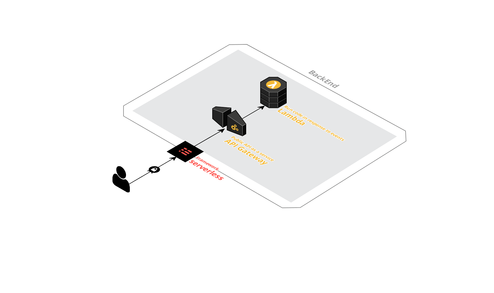

## AWS Lambda + Serverless Deploy

> Create smart AWS diagrams [Cloudcraft](https://cloudcraft.co/)

## Production

* [Lambda](https://aws.amazon.com/ko/lambda/) : 서버를 프로비저닝하거나 관리할 필요 없이 코드를 실행할 수 있습니다. 사용한 컴퓨팅 시간에 대해서만 비용을 지불하면 됩니다.

* [API Gateway](https://aws.amazon.com/ko/api-gateway/) : 어떤 규모에서든 개발자가 API를 손쉽게 생성, 게시, 유지, 관리, 모니터링 및 보안 유지할 수 있도록 하는 완전관리형 서비스

* [Identity and Access Management(IAM)](https://aws.amazon.com/ko/iam/) : AWS 서비스와 리소스에 대한 액세스를 안전하게 관리할 수 있습니다.

* [Serverless](https://serverless.com/) : 서버리스 애플리케이션 구축 및 운영을 위한 완벽한 솔루션
